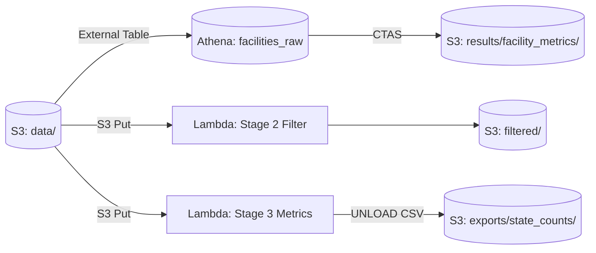
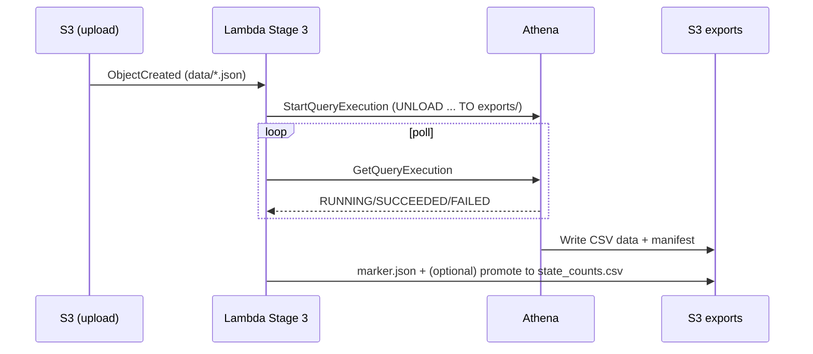

# Architecture Notes

This document explains the components and their interactions for Stages 1–3.

## Components
- **Amazon S3** – raw inputs, filtered outputs (NDJSON), Parquet datasets, and final CSV exports.
- **Amazon Athena** – schema-on-read over JSON, CTAS to Parquet, and UNLOAD to CSV.
- **AWS Lambda (Stage 2)** – parses & filters expiring accreditations, tolerant to JSON shapes.
- **AWS Lambda (Stage 3)** – event-driven Athena query; idempotent, retry-safe; writes previewable CSV.

## Diagrams

### System Overview

### Stage 3 Sequence

## Security & Permissions
- **Lambda role:** Athena Start/Get; Glue read; S3 Get on `data/`; S3 Put on `exports/`; KMS if required.
- **Workgroup:** If “Enforce settings” → ensure role can write to the enforced results bucket/KMS.
- **Bucket policies:** Same-account access is sufficient with role policies; cross-account requires bucket policy grants.

## Operational Notes
- Use **fresh prefixes** for CTAS outputs.
- Prefer **DATE casts** when persisting timestamps via CTAS.
- Keep Lambda timeouts ≥ 2 minutes; code exits early to let retries resume.
- S3 CSV files are previewable when `compression='NONE'`.
