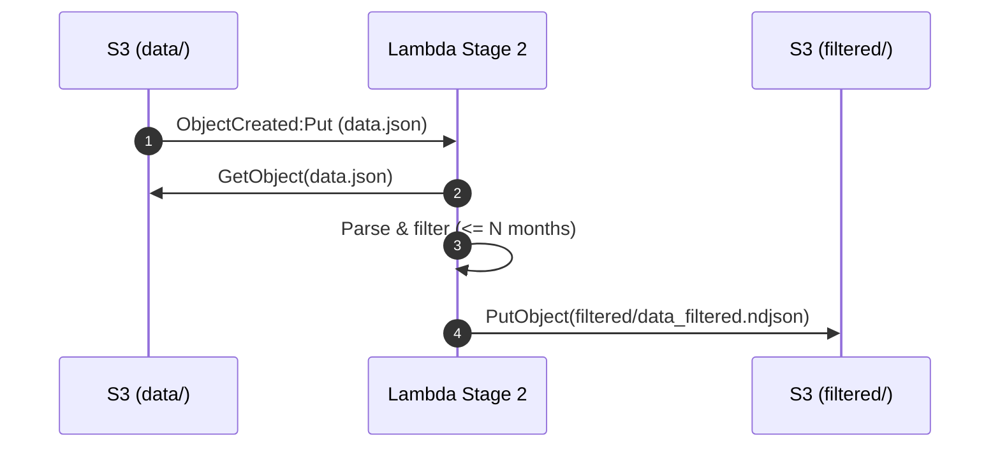
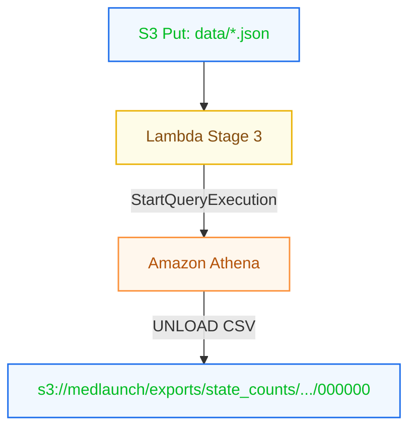

# MedLaunch – Facility Metrics Pipeline (Stages 1–3)

This repository contains an end‑to‑end data flow that ingests facility JSON from S3, models it in Athena, filters expiring accreditations with Python/Lambda, and runs an event‑driven Athena query to publish state‑level metrics to S3 (previewable CSV).

## Quick Links
- **Stages implemented:** 1, 2, 3
- **Demo video:** _add link_
- **Primary bucket:** `s3://medlaunch`
- **Athena database:** `medlaunch_db`
- **Source table:** `facilities_raw`

---

## High‑Level Architecture

```mermaid
flowchart LR
  subgraph S3["Amazon S3"]
    A[data/data.json<br/>NDJSON/JSON]:::s3
    B[filtered/*.ndjson]:::s3
    C[exports/state_counts/<...>/000000<br/>(CSV)]:::s3
    P[results/facility_metrics/run_*/part-*.parquet]:::s3
  end

  subgraph Athena["Amazon Athena"]
    T[(facilities_raw)]:::athena
    M[(facility_metrics)]:::athena
  end

  subgraph Lambda["AWS Lambda"]
    L2[Stage 2 Filter Function]:::lambda
    L3[Stage 3 On-Upload Metrics]:::lambda
  end

  A -- Stage 1: External Table --> T
  T -- CTAS --> P
  A -- S3 Event (optional) --> L2
  L2 -- writes --> B
  A -- S3 Event --> L3
  L3 -- UNLOAD CSV --> C
  T -- queried by --> L3

classDef s3 fill:#f1f8ff,stroke:#1f6feb,color:#0b2,stroke-width:1.5px;
classDef athena fill:#fff7ed,stroke:#fb923c,color:#b45309,stroke-width:1.5px;
classDef lambda fill:#fefce8,stroke:#eab308,color:#854d0e,stroke-width:1.5px;
```

---

## Stage 1 — Athena Data Modeling & Extraction

### 1. Create database & external table
```sql
CREATE DATABASE IF NOT EXISTS medlaunch_db;
USE medlaunch_db;

CREATE EXTERNAL TABLE IF NOT EXISTS facilities_raw (
  facility_id string,
  facility_name string,
  location struct<address:string, city:string, state:string, zip:string>,
  employee_count int,
  services array<string>,
  labs array<struct<lab_name:string, certifications:array<string>>>,
  accreditations array<struct<accreditation_body:string, accreditation_id:string, valid_until:string>>
)
ROW FORMAT SERDE 'org.openx.data.jsonserde.JsonSerDe'
LOCATION 's3://medlaunch/data/'
TBLPROPERTIES ('ignore.malformed.json'='true');
```

### 2. Extract key metrics (no correlated subqueries)
```sql
WITH acc_min AS (
  SELECT r.facility_id,
         MIN(TRY_CAST(a.valid_until AS DATE)) AS expiry_date_of_first_accreditation
  FROM facilities_raw r
  CROSS JOIN UNNEST(r.accreditations) AS t(a)
  GROUP BY r.facility_id
)
SELECT f.facility_id,
       f.facility_name,
       f.employee_count,
       CARDINALITY(f.services) AS number_of_offered_services,
       acc_min.expiry_date_of_first_accreditation
FROM facilities_raw f
LEFT JOIN acc_min ON acc_min.facility_id = f.facility_id;
```

### 3. Persist results to S3 as Parquet (CTAS)
```sql
CREATE TABLE facility_metrics
WITH (
  external_location = 's3://medlaunch/results/facility_metrics/run_YYYY_MM_DD_1/',
  format = 'PARQUET'
) AS
WITH acc_min AS (
  SELECT r.facility_id,
         MIN(TRY_CAST(a.valid_until AS DATE)) AS expiry_date_of_first_accreditation
  FROM facilities_raw r
  CROSS JOIN UNNEST(r.accreditations) AS t(a)
  GROUP BY r.facility_id
)
SELECT f.facility_id,
       f.facility_name,
       f.employee_count,
       CARDINALITY(f.services) AS number_of_offered_services,
       acc_min.expiry_date_of_first_accreditation
FROM facilities_raw f
LEFT JOIN acc_min ON acc_min.facility_id = f.facility_id;
```

_Notes:_ Use a **folder** (trailing `/`) for `LOCATION`/`external_location`; cast dates to avoid timezone types; never point a table at the workgroup’s `queryResults/`.

---

## Stage 2 — Data Processing with Python (boto3)

### Purpose
Filter facilities whose **any** accreditation expires within _N_ months and write NDJSON back to S3.

### Lambda handler (summary)
- Reads env: `BUCKET`, `INPUT_PREFIX`, `OUTPUT_PREFIX`, `MONTHS`
- Accepts either **S3 Put event** (process that object) or **manual run** (scan prefix)
- Supports NDJSON / JSON array / concatenated JSON
- Writes `*_filtered.ndjson`

### Sequence



### Run locally (example)
```bash
python filter_expiring_accreditations.py \
  --bucket medlaunch \
  --input-prefix data/ \
  --output-prefix filtered/ \
  --months 6
```

---

## Stage 3 — Event‑Driven Metrics (Lambda + Athena UNLOAD)

### Purpose
On every new upload to `data/`, run an Athena query to count **accredited facilities per state** and **UNLOAD** CSV (with header) to S3.

### Query shape (used by Lambda)
```sql
UNLOAD (
  SELECT *
  FROM (
    SELECT 0 AS _order, 'state' AS state, 'accredited_facilities' AS accredited_facilities
    UNION ALL
    SELECT 1 AS _order, state, CAST(accredited_facilities AS VARCHAR)
    FROM (
      SELECT r.location.state AS state,
             COUNT(DISTINCT r.facility_id) AS accredited_facilities
      FROM medlaunch_db.facilities_raw r
      CROSS JOIN UNNEST(r.accreditations) AS t(a)
      WHERE TRY_CAST(a.valid_until AS DATE) >= current_date
      GROUP BY r.location.state
    ) s
  ) out
  ORDER BY _order, state
)
TO 's3://medlaunch/exports/state_counts/<bucket>/<urlencoded-key>/<YYYY-MM-DD>/'
WITH (format='TEXTFILE', field_delimiter=',', compression='NONE');
```

### Event flow



### Ops
- **Timeouts & retries:** Lambda polls Athena with backoff and exits early before timeout so retries can continue (idempotent via ClientRequestToken).
- **Outputs:** Previewable CSV in `exports/state_counts/.../000000` plus a small manifest and `marker.json`.
- **Permissions:** Lambda role needs Athena Start/Get, Glue read, S3 Get on `data/`, S3 Put on `exports/` (and KMS if enforced).

---

## S3 Layout

```
s3://medlaunch/
  data/
    data.json
  filtered/
    data_filtered.ndjson
  results/
    facility_metrics/run_YYYY_MM_DD_1/part-*.parquet
  exports/
    state_counts/<bucket>/<urlencoded-key>/<YYYY-MM-DD>/
      000000
      manifest
      marker.json
```

---

## Troubleshooting Cheatsheet

- **Athena: Cannot create table on file** → point to a **folder** (trailing `/`).
- **timestamp with time zone in CTAS** → cast to `DATE` (or tz-less TIMESTAMP).
- **PAR1 / HIVE_BAD_DATA** → table LOCATION includes non‑Parquet files.
- **UNLOAD only shows manifest** → the `000000` object(s) are the data; click **Open**.
- **AccessDenied** → add S3 Put/Get/List, Athena Start/Get, Glue read; include KMS if used.
- **Correlated subquery not supported** → use `CROSS JOIN UNNEST` + aggregate.

---

## Cost & Limits (free‑tier friendly)
- Athena scanned bytes minimized via Parquet outputs.
- Lambda is event‑driven; short invocations. No servers to run.
- S3 storage only for small CSV/Parquet artifacts.

---

## How to Reproduce (short)
1. Upload `data.json` to `s3://medlaunch/data/`.
2. Run Stage 1 SQL (DDL + CTAS).
3. Deploy Stage 2 Lambda; set env; Test with S3 event.
4. Deploy Stage 3 Lambda; set env; add S3 trigger; upload again.
5. Open results at `exports/state_counts/.../000000` (CSV preview).

